## 1. Git是什么

1.  svn是集中化的版本控制系统，git是分布式版本控制系统
2.  git直接记录快照，而非差异比较
3.  近乎所有的操作都是本地执行

## 2. 基本操作

> Git基本操作:  https://www.runoob.com/git/git-basic-operations.html

### 2.1. 使用当前目录作为Git仓库

```bash
进入该目录，右键进入git命令行模式
#添加版本库
git init
#将本地文件添加到暂存区
git add .  
# 将文件提交到版本库
git commit -m "注释"  
#添加一个远程 Git 仓库，同时指定一个可以引用的简写origin
git remote add origin https://gitee.com/yangqinglei26/study-notes.git  
#将本地版本库推送到远程版本库进行合并
git push -u origin master  
# 显示远程仓库
git remote -v
```

### 2.2. 记录每次更新到仓库

```bash
#查看文件状态
git status  
#文件状态从untracked变为staged，文件被添加到暂存区
git add  
#查看暂存前后的变化
git diff  
```

### 2.3. 忽略文件

- 文件 .gitignore 的格式规范如下：

  ```
  所有空行或者以 # 开头的行都会被 Git 忽略。
  可以使用标准的 glob 模式匹配，它会递归地应用在整个工作区中。所谓的 glob 模式是指 shell 所使用的简化了的正则表达式。
  匹配模式可以以（/）开头防止递归。
  匹配模式可以以（/）结尾指定目录。
  要忽略指定模式以外的文件或目录，可以在模式前加上叹号（!）取反。
  ```

## 3. 分支管理

> Git分支管理策略:  https://www.ruanyifeng.com/blog/2012/07/git.html

### 3.1. 创建合并分支

```bash
#查看当前分支
git branch 
#创建分支
git branch dev
#切换分支
git checkout dev
#创建并切换到一个分支里面
git checkout -b dev
#查看记录
git log --pretty=oneline
#合并记录,出现fast-forward就是快速合并
git merge dev
#执行正常合并，在Master分支上生成一个新节点
git merge --no-ff dev
#合并之后，就可以删除dev分支
git checkout -d dev
```

### 3.2. 解决冲突

- 在不同分支上，都编辑了同一个文件，这时候合并，会出现冲突。**解决方法：**手动进行合并，在code文件中。然后在进行add和commit操作

- 软件开发中，遇到bug就像是家常便饭。当遇到bug的时候，每一个bug都要用过临时的分支来修复，修复后在合并分支，然后将临时分支删除。
  当你正在做某项任务的时候，临时有个紧急的任务，修复bug，但是你的代码没有写完，不能提交，可以通过下面的命令进行存储，等你修复完成之后，可以继续做。

  ```bash
  #存储工作现场
  git stash
  #查看存储工作现场
  git stash list
  #恢复存储工作现场
  git stash pop
  ```

## 4. 查看提交历史

## 5. 标签管理

## 6. 服务器搭建

## 7. 扩展

### 7.1. SSH配置

#### 7.1.1. 检测SSH配置情况

```bash
# 进入ssh目录
cd ~/.ssh
# 查看是否有id_rsa  id_rsa.pub 
ls
# 如果没有id_rsa  id_rsa.pub ，进入第2步
```


#### 7.1.2. 配置SSH

##### 7.1.2.1. 查询是否配置了全局参数

```bash
git config --global  --list 
```


- 如果未配置，执行以下命令：

```bash
# git config --global  user.name "这里换上你的用户名"
git config --global  user.name "yangqinglei26"
# git config --global user.email "这里换上你的邮箱"
git config --global user.email "dandetionyang@163.com"
```

##### 7.1.2.2. 生成公钥

```bash
ssh-keygen -o
```

> 执行命令后需要进行3次或4次确认：
>
> 确认秘钥的保存路径（如果不需要改路径则直接回车）；
> 如果上一步置顶的保存路径下已经有秘钥文件，则需要确认是否覆盖（如果之前的秘钥不再需要则直接回车覆盖，如需要则手动拷贝到其他目录后再覆盖）；
> 创建密码（如果不需要密码则直接回车）；
> 确认密码；
> 执行过程如下图：

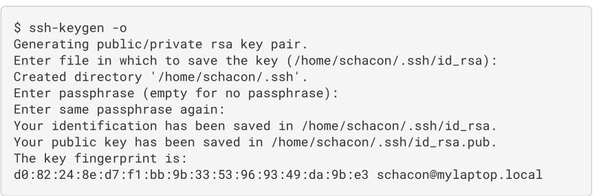

##### 7.1.2.3. 查看公钥

```bash
cat ~/.ssh/id_rsa.pub
```

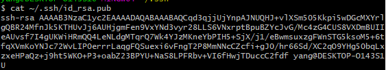

##### 7.1.2.4. 复制公钥到github

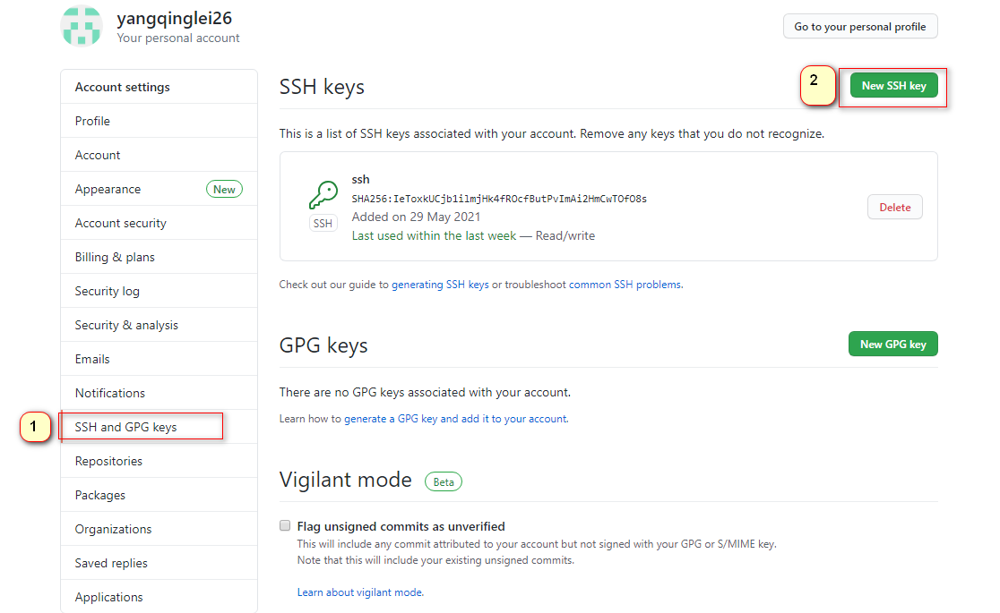

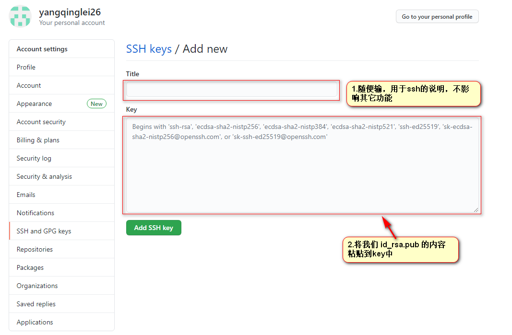

> 参考资料：[Git官方文档](https://git-scm.com/book/zh/v2/%E6%9C%8D%E5%8A%A1%E5%99%A8%E4%B8%8A%E7%9A%84-Git-%E7%94%9F%E6%88%90-SSH-%E5%85%AC%E9%92%A5)

## 8. GitTalk使用

> 帮助手册：https://github.com/gitalk/gitalk/blob/master/readme-cn.md

### 8.1. 我们选取其中一种方式做说明

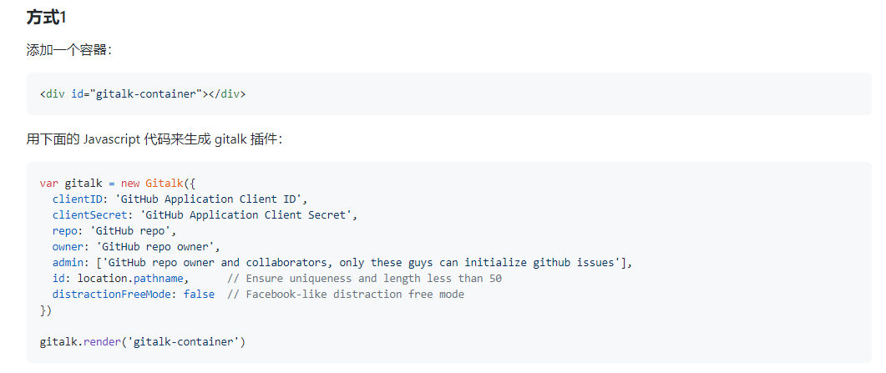

#### 8.1.1. 获取owner、repo

> 参考资料： [github 接口文档](https://docs.github.com/en/rest/reference/issues)

gittalk会根据输入的参数去调用github接口，查询对应的issue

```
https://api.github.com/repos/{owner}/{repo}/issues
```

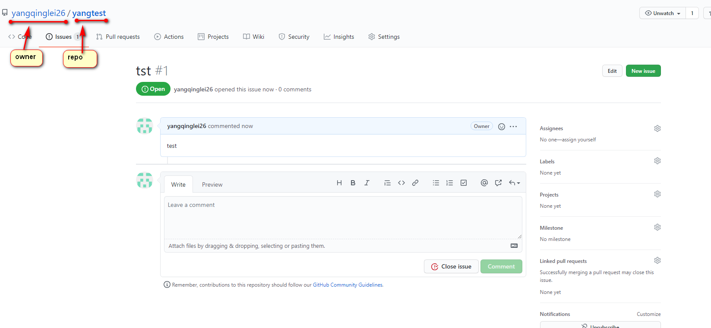

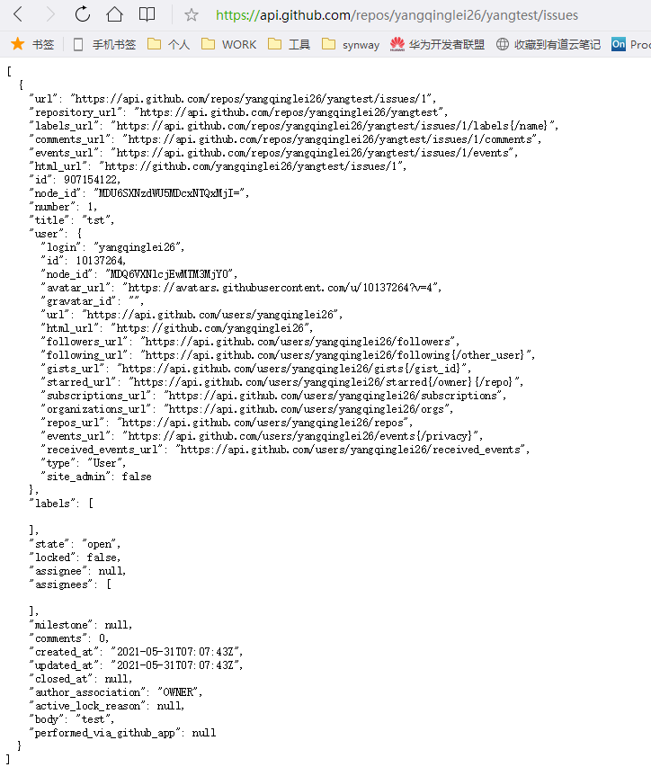

#### 8.1.2. 生成clientID、clientSecret

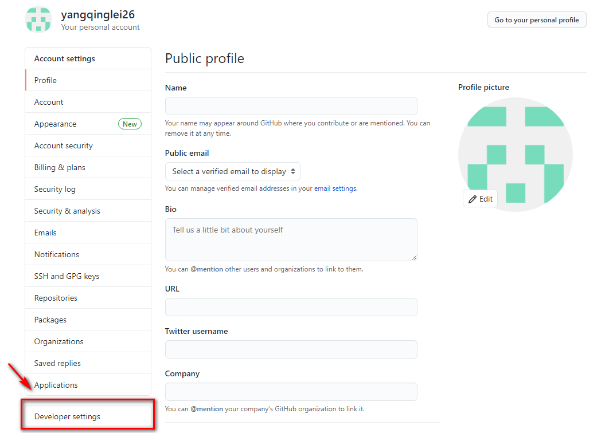

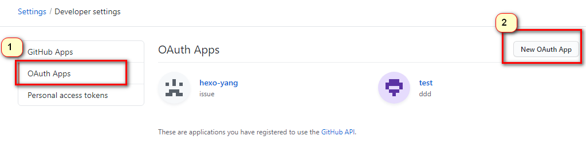

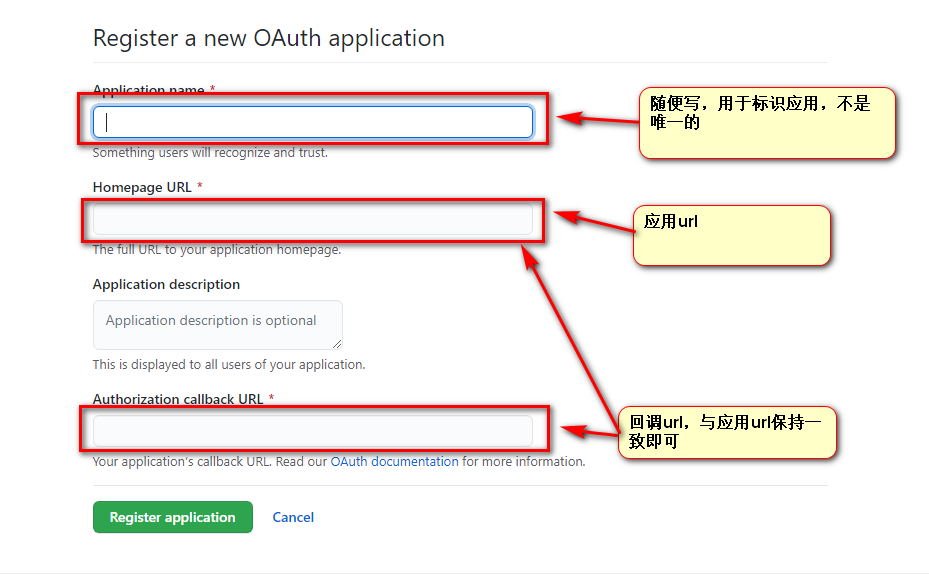

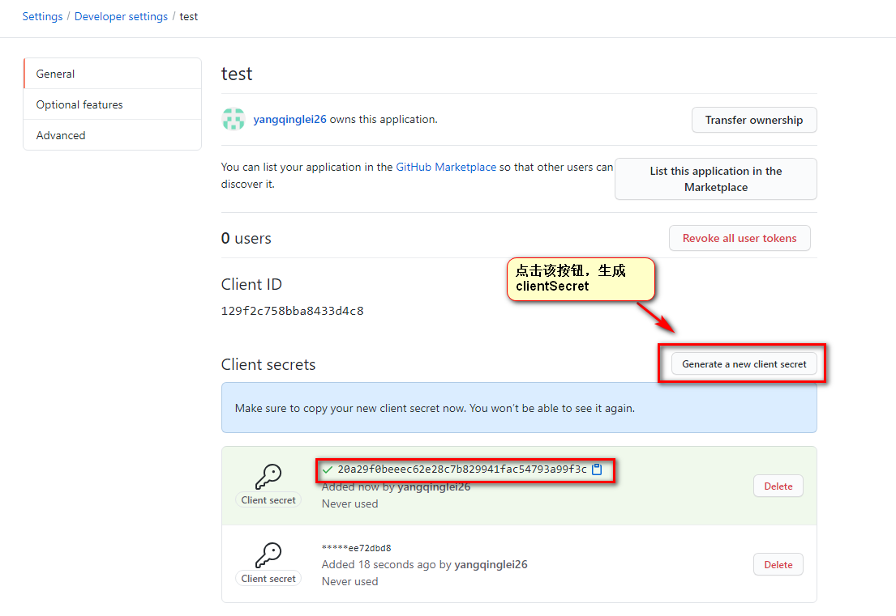

#### 8.1.3. 参考

```yaml
clientID: 129f2c758bba8433d4c8
clientSecret: 20a29f0beeec62e28c7b829941fac54793a99f3c
repo: yangqinglei26
owner: yangtest
admin: [yangqinglei26]
```

