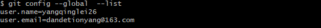

##  Git是什么

1.  svn是集中化的版本控制系统，git是分布式版本控制系统
2.  git直接记录快照，而非差异比较
3.  近乎所有的操作都是本地执行

## 基本操作

> Git基本操作:  https://www.runoob.com/git/git-basic-operations.html
>
> https://zhuanlan.zhihu.com/p/30044692
>
> Gitflow: https://blog.csdn.net/sunyctf/article/details/130587970
>
> Submodule: https://juejin.cn/post/6948251963133788196
>
> Subtree: https://zhuanlan.zhihu.com/p/614299771

### 常用命令

#### 初始化仓库

- **git init**：在当前目录下创建一个新的Git仓库，生成一个.git的隐藏目录，用于存储仓库的元数据和对象数据。

#### 配置用户信息

- git config：用于配置Git的各种选项和变量。
  - `git config --global user.name "Your Name"`：设置全局的用户名。
  - `git config --global user.email "your@example.com"`：设置全局的邮箱地址。

####  克隆仓库

- **git clone [url]**：从远程仓库克隆一个项目的完整副本到本地。

#### 添加文件到暂存区

- git add：将文件或目录添加到暂存区，以备提交。
  - `git add <file>`：添加单个文件。
  - `git add <file1> <file2> ...`：添加多个文件。
  - `git add .`：添加当前目录下的所有文件（不包括子目录中的文件）。
  - `git add -A` 或 `git add --all`：添加所有已修改、已删除和已新建的文件（跳过未跟踪的文件）。

#### 提交更改

- git commit：将暂存区的更改提交到本地仓库。
  - `git commit -m "message"`：提交暂存区的更改，并附上提交信息。
  - `git commit -am "message"`：跳过`git add`步骤，直接提交所有已跟踪文件的更改。
  - `git commit --amend -m "message"`：修改最近一次提交的提交信息。

#### 查看状态与日志

- **git status**：显示工作区和暂存区的状态。
- **git log**：显示提交日志。

#### 分支管理

- git branch：列出、创建或删除分支。
  - `git branch`：列出所有本地分支。
  - `git branch [branch-name]`：创建新分支，但不切换。
  - `git branch -d [branch-name]`：删除已合并的分支。
  - `git branch -D [branch-name]`：强制删除分支，无论是否已合并。
- git checkout：切换分支或恢复工作区文件。
  - `git checkout [branch-name]`：切换分支。
  - `git checkout -b [branch-name]`：创建新分支并切换到该分支。
- git merge：合并分支。
  - `git merge [branch-name]`：将指定分支合并到当前分支。

####  推送与拉取

- git push：将本地分支的更改推送到远程仓库。
  - `git push [remote-name] [branch-name]`：将指定分支推送到远程仓库。
  - `git push --set-upstream [remote-name] [branch-name]`：在推送的同时设置上游（跟踪）分支。
- git pull：从远程仓库拉取最新更改并合并到本地分支。
  - `git pull [remote-name] [branch-name]`：拉取指定分支的更改并合并到当前分支。

#### 其他常用命令

- **git stash**：暂存当前工作区的更改，以便稍后恢复。
- **git stash pop**：恢复最近一次暂存的更改，并将其从暂存列表中删除。
- **git reflog**：查看命令历史，包括已经被删除的提交和分支。

### 使用当前目录作为Git仓库

```bash
进入该目录，右键进入git命令行模式
#添加版本库
git init
#将本地文件添加到暂存区
git add .  
# 将文件提交到版本库
git commit -m "注释"  
#添加一个远程 Git 仓库，同时指定一个可以引用的简写origin
git remote add origin https://gitee.com/yangqinglei26/study-notes.git  
#将本地版本库推送到远程版本库进行合并
git push -u origin master  
# 显示远程仓库
git remote -v
```

### 记录每次更新到仓库

```bash
#查看文件状态
git status  
#文件状态从untracked变为staged，文件被添加到暂存区
git add  
#查看暂存前后的变化
git diff  
```

### 忽略文件

- 文件 .gitignore 的格式规范如下：

  ```
  所有空行或者以 # 开头的行都会被 Git 忽略。
  可以使用标准的 glob 模式匹配，它会递归地应用在整个工作区中。所谓的 glob 模式是指 shell 所使用的简化了的正则表达式。
  匹配模式可以以（/）开头防止递归。
  匹配模式可以以（/）结尾指定目录。
  要忽略指定模式以外的文件或目录，可以在模式前加上叹号（!）取反。
  ```

### git stash

Git 中的 `stash` 功能是一个非常有用的特性，它允许你临时保存你当前的工作进度（包括修改和暂存区的改动），然后在需要的时候重新应用这些改动。这个功能在你需要暂时切换到另一个分支进行工作，但又不想提交当前正在进行的工作时特别有用。

以下是 Git stash 的基本使用方法：

#### 保存当前工作进度

要保存当前的工作进度，你可以使用 `git stash` 命令。这会保存你当前工作目录和暂存区的所有改动，并将你的工作目录重置为最后一次提交的状态。

```bash
git stash
```

你可以通过添加一些消息来标识你的 stash，这有助于后续识别和管理 stash：

```bash
git stash save "我的工作进度"
```

####  查看 stash 列表

要查看你保存的 stash 列表，可以使用 `git stash list` 命令。这会列出所有保存的 stash，包括它们的保存时间和描述（如果你提供了描述的话）。

```bash
git stash list
```

####  应用 stash

要重新应用一个 stash，你可以使用 `git stash pop` 命令。这会应用你最新的 stash（即列表中最近的 stash），并从列表中删除它。

```bash
git stash pop
```

如果你想应用特定的 stash（而不是最新的），你可以使用 `git stash apply <stash_id>` 命令，其中 `<stash_id>` 是你通过 `git stash list` 看到的 stash 的标识符。注意，使用 `apply` 而不是 `pop` 会保留 stash 在列表中，以便你可以再次应用它。

```bash
git stash apply stash@{1}
```

####  丢弃 stash

如果你不再需要某个 stash，你可以使用 `git stash drop <stash_id>` 命令来删除它。

```bash
git stash drop stash@{1}
```

或者，如果你想删除所有的 stash，可以使用：

```bash
git stash clear
```

#### 应用 stash 并解决冲突

如果应用 stash 时遇到了冲突，Git 会停止并让你解决这些冲突。解决冲突后，你需要像处理普通的合并冲突一样，添加修改并继续 stash 的应用。

#### 总结

Git stash 是一个强大的工具，可以帮助你管理临时的工作进度。通过合理使用 stash，你可以更加灵活地切换分支和工作任务，而不必担心丢失当前的工作进度。

### git cherry-pick

`git cherry-pick` 是 Git 中的一个非常有用的命令，它允许你将一个已经存在于其他分支中的提交（commit）应用到你当前的分支上。这在你想要将一个分支上的某个更改或修复合并到另一个分支，但又不想合并整个分支时特别有用。

### git reset

`git reset` 是 Git 版本控制系统中一个非常强大的命令，它用于将当前的 HEAD 指针重置到指定的提交（commit）、分支（branch）或标签（tag）上。这个命令可以影响你的工作目录和暂存区（staging area，也称作索引或index），具体取决于你使用的选项。

`git reset` 命令主要有三种使用模式，每种模式的行为略有不同：

1. **--soft**（软重置）: 仅将 HEAD 指针重置到指定的提交，而不改变暂存区和工作目录中的文件。这意味着，自那个提交以来你所做的所有更改都将保留在暂存区中，就像你刚刚做了那些更改并准备再次提交一样。

   使用方式：`git reset --soft <commit>`

2. **--mixed**（混合重置，这是默认行为）: 将 HEAD 指针和暂存区都重置到指定的提交，但工作目录中的文件保持不变。这意味着，自那个提交以来你所做的更改都会留在工作目录中，但是会被视为未暂存的更改。

   使用方式：`git reset <commit>` 或 `git reset --mixed <commit>`

3. **--hard**（硬重置）: 将 HEAD 指针、暂存区和工作目录都重置到指定的提交。这意味着，自那个提交以来你所做的所有更改都会被丢弃。这是最危险的使用方式，因为它会丢失未提交的更改。

   使用方式：`git reset --hard <commit>`

### git revert

`git revert` 是 Git 版本控制系统中的一个命令，用于撤销之前的某个提交（commit），但与 `git reset` 不同，`git revert` 不会改变项目历史中的现有提交。相反，它会创建一个新的提交来“撤销”之前的某个提交所做的更改。这意味着，使用 `git revert` 后，你的项目历史会保持线性并且易于跟踪，同时保持了所有提交的完整性。

## 分支管理

> Git分支管理策略:  https://www.ruanyifeng.com/blog/2012/07/git.html

### 创建合并分支

```bash
#查看当前分支
git branch 
#创建分支
git branch dev
#切换分支
git checkout dev
#创建并切换到一个分支里面
git checkout -b dev
#查看记录
git log --pretty=oneline
#合并记录,出现fast-forward就是快速合并
git merge dev
#执行正常合并，在Master分支上生成一个新节点
git merge --no-ff dev
#合并之后，就可以删除dev分支
git checkout -d dev
```

### 解决冲突

- 在不同分支上，都编辑了同一个文件，这时候合并，会出现冲突。**解决方法：**手动进行合并，在code文件中。然后在进行add和commit操作

- 软件开发中，遇到bug就像是家常便饭。当遇到bug的时候，每一个bug都要用过临时的分支来修复，修复后在合并分支，然后将临时分支删除。
  当你正在做某项任务的时候，临时有个紧急的任务，修复bug，但是你的代码没有写完，不能提交，可以通过下面的命令进行存储，等你修复完成之后，可以继续做。

  ```bash
  #存储工作现场
  git stash
  #查看存储工作现场
  git stash list
  #恢复存储工作现场
  git stash pop
  ```

##  查看提交历史


## 标签管理

## 服务器搭建

## .git 目录结构

```
.git                          # Git 仓库的根目录，包含所有版本控制相关的文件和子目录
├── HEAD                      # 指向当前检出的分支
├── config                    # 仓库的配置文件，存储仓库级别的配置选项
├── description               # 描述文件，仅供 GitWeb 使用
├── hooks                     # 钩子目录，包含客户端或服务端钩子脚本
│   ├── applypatch-msg.sample # 示例钩子脚本，在 git applypatch 运行时触发
│   ├── commit-msg.sample     # 示例钩子脚本，在 git commit 提交时触发
│   ├── post-update.sample    # 示例钩子脚本，在 git push 运行时触发
│   ├── pre-applypatch.sample # 示例钩子脚本，在 git applypatch 运行前触发
│   ├── pre-commit.sample     # 示例钩子脚本，在 git commit 运行前触发
│   ├── pre-push.sample       # 示例钩子脚本，在 git push 运行前触发
│   ├── pre-rebase.sample     # 示例钩子脚本，在 git rebase 运行前触发
│   ├── prepare-commit-msg.sample # 示例钩子脚本，在 git commit 编辑提交信息前触发
│   └── update.sample         # 示例钩子脚本，在 git push 更新远程分支时触发
├── info                      # 包含额外的可选信息
│   └── exclude               # 存储排除文件的规则（类似于 .gitignore）
├── objects                   # 存储所有的 Git 对象（blobs、trees、commits、tags）
│   ├── info                  # 额外的对象信息（通常为空）
│   └── pack                  # 已打包的对象，以提高存储和传输效率
├── refs                      # 存储分支、标签和远程追踪分支的信息
│   ├── heads                 # 存储本地分支的引用
│   ├── tags                  # 存储标签的引用
│   └── remotes               # 存储远程分支的引用
├── logs                      # 存储提交记录日志
│   ├── HEAD                  # HEAD 的提交记录
│   └── refs                  # 各个分支和引用的提交记录
│       └── heads             # 本地分支的提交记录
├── packed-refs               # 存储已打包的引用（分支和标签），以提高效率
└── index                     # 暂存区信息文件，记录暂存区的文件快照信息

```

### 暂存区

1. [Git三大特色之Stage(暂存区)](https://blog.csdn.net/qq_32452623/article/details/78417609)

```

```


## 扩展

### SSH配置

#### 检测SSH配置情况

```bash
# 进入ssh目录
cd ~/.ssh
# 查看是否有id_rsa  id_rsa.pub 
ls
# 如果没有id_rsa  id_rsa.pub ，进入第2步
```


####  配置SSH

##### 查询是否配置了全局参数

```bash
git config --global  --list 
```



- 如果未配置，执行以下命令：

```bash
# git config --global  user.name "这里换上你的用户名"
git config --global  user.name "yangqinglei26"
# git config --global user.email "这里换上你的邮箱"
git config --global user.email "dandetionyang@163.com"
```

#####  生成公钥

```bash
ssh-keygen -o
```

> 执行命令后需要进行3次或4次确认：
>
> 确认秘钥的保存路径（如果不需要改路径则直接回车）；
> 如果上一步置顶的保存路径下已经有秘钥文件，则需要确认是否覆盖（如果之前的秘钥不再需要则直接回车覆盖，如需要则手动拷贝到其他目录后再覆盖）；
> 创建密码（如果不需要密码则直接回车）；
> 确认密码；
> 执行过程如下图：


##### 查看公钥

```bash
cat ~/.ssh/id_rsa.pub
```


##### 复制公钥到github


> 参考资料：[Git官方文档](https://git-scm.com/book/zh/v2/%E6%9C%8D%E5%8A%A1%E5%99%A8%E4%B8%8A%E7%9A%84-Git-%E7%94%9F%E6%88%90-SSH-%E5%85%AC%E9%92%A5)

##  GitTalk使用

> 帮助手册：https://github.com/gitalk/gitalk/blob/master/readme-cn.md

### 我们选取其中一种方式做说明


#### 获取owner、repo

> 参考资料： [github 接口文档](https://docs.github.com/en/rest/reference/issues)

gittalk会根据输入的参数去调用github接口，查询对应的issue

```
https://api.github.com/repos/{owner}/{repo}/issues
```


#### 生成clientID、clientSecret


#### 参考

```yaml
clientID: 129f2c758bba8433d4c8
clientSecret: 20a29f0beeec62e28c7b829941fac54793a99f3c
repo: yangqinglei26
owner: yangtest
admin: [yangqinglei26]
```

