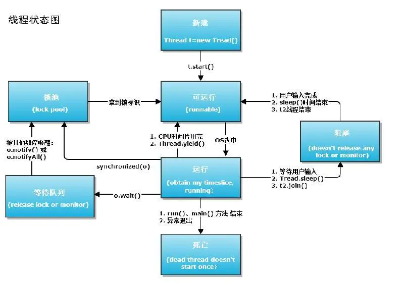
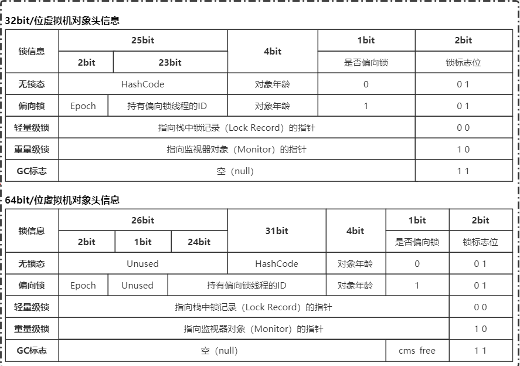
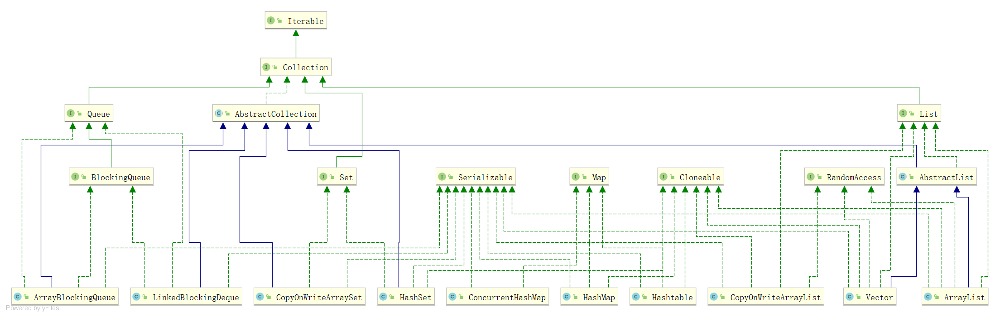
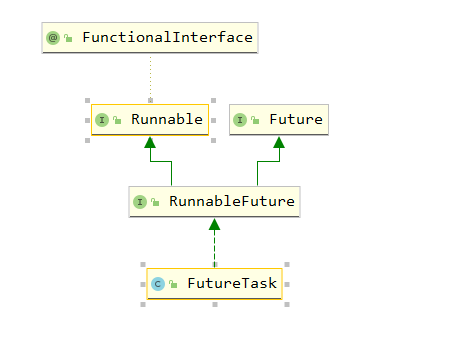
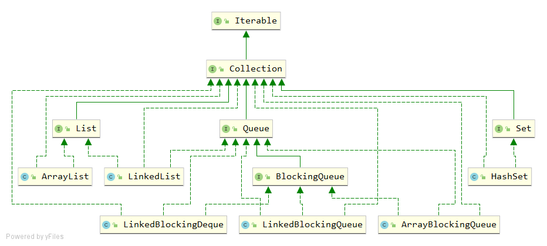
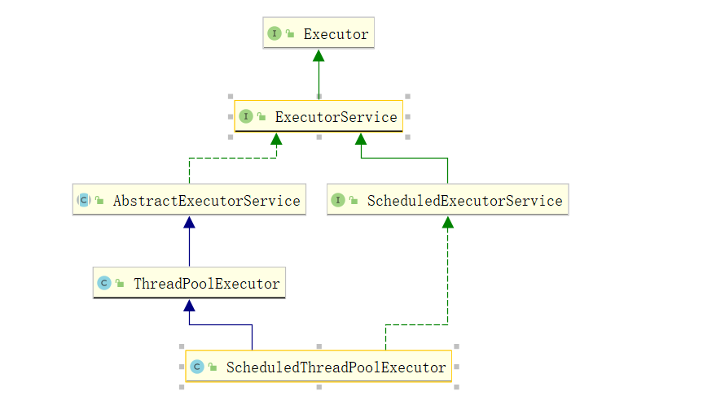
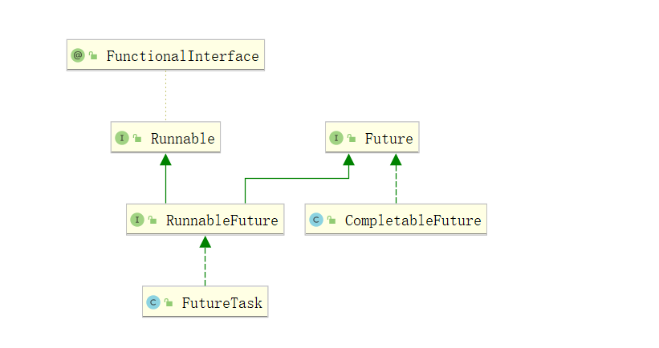
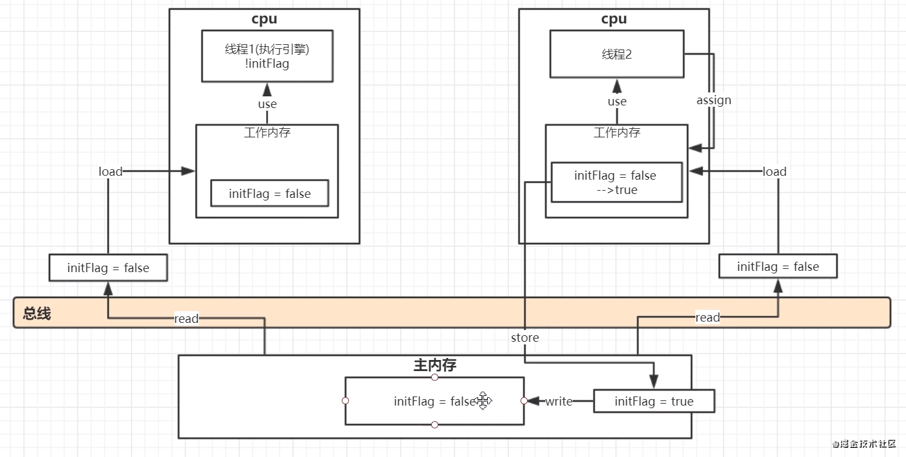

## 1. IO和NIO

## 2. 多线程

> [Java Thread 的使用](https://www.cnblogs.com/renhui/p/6066852.html)
>
> [Thread的join()方法](https://blog.csdn.net/a158123/article/details/78633772)
>
> [Java终止线程的三种方式](https://www.cnblogs.com/haolb123/p/14323815.html)




### 2.1. 创建线程

#### 2.1.1. 实现Runnable接口

> 推进使用：方便同一个对象被多个线程使用

```java
new Thread(Runnable 实现).start()
```

#### 2.1.2. 继承Thread

#### 2.1.3. 实现Callable接口

```
实现Callable接口，需要返回值类型
重写call方法，需要抛出异常
创建目标对象
创建执行服务：ExecutorService ser = Executors.newFixedThreadPool(1);
提交执行：Future<Boolean> result1 = ser.submit(t1);
获取结果：boolean r1 = result1.get()
关闭服务：ser.shutdownNow()
```

### 2.2. 停止线程

#### 2.2.1. 设置一个标志位

```java
publ
```

### 2.3. 礼让线程

> yield()

- 礼让线程，让当前正在执行的线程暂停，但不阻塞
- 将线程从运行状态转为就绪状态
- 让cpu重新调度，礼让不一定成功！看cpu心情

### 2.4. 强制执行线程

> join()

### 2.5. 线程优先级

> priority(1-10)

- 先设置优先级，再start()

### 2.6. 守护线程

### 2.7. 线程同步

- 队列+锁

- synchronized 
- lock

### 2.8. 线程通信

- 生产者和消费者问题
- synchronized 
- while 防止虚假唤醒

- wait()、notifyall()

#### 2.8.1. 管程法

- 缓冲池

#### 2.8.2. 信号灯法

- 标志位

### 2.9. 线程池


## 3. 注解和反射

## 4. JUC

> [参考资料1](https://www.processon.com/view/5ff905961e0853437c6d010c?fromnew=1#map) 
>
> [参考资料2](https://www.processon.com/view/60595e325653bb2225dee274?fromnew=1#map)
>
> [ThreadLocal](https://www.jianshu.com/p/3c5d7f09dfbd) [Java中的ThreadLocal详解](https://www.cnblogs.com/fsmly/p/11020641.html) [多个 THREADLOCAL 在 THREAD 中的 THREADLOCALS 里是怎么存储的](https://www.freesion.com/article/85951314530/)
>
> [Java并发编程之happens-before和as-if-serial语义](https://blog.csdn.net/byhook/article/details/87971081)
>
> [java并发](https://www.topjava.cn/article/1391297837127569408)

### 4.1. wait和sleep的区别

- 来自不同的类

wait => object    sleep => Thread

- 锁的释放

wait 会释放锁，sleep 不会释放

- 使用范围

wait 在 synchronized 中使用

### 4.2. Lock锁

#### 4.2.1. ReentrantLock

- 默认非公平锁
- 必须成对出现
- 示例：

```java
public class ReentrantLockTest {

    public static void main(String[] args) {

        Mycache mycache = new Mycache();

        for (int i = 0; i < 3; i++) {
            new Thread(()->{
                for (int j = 0; j < 2; j++){
                    try {
                        mycache.put(Thread.currentThread().getName()+":"+j,"toy"+j);
                    } catch (InterruptedException e) {
                        e.printStackTrace();
                    }
                }
            },"thread"+i).start();
        }

        for (int i = 0; i < 3; i++) {
            new Thread(()->{
                for (int j = 0; j < 2; j++){
                    mycache.get(Thread.currentThread().getName()+":"+j);
                }
            },"thread"+i).start();
        }
    }

     static class Mycache{

        Map<String,String> map = new HashMap<>();
        ReentrantLock lock = new ReentrantLock();
        public void put(String key,String value) throws InterruptedException {
            lock.lock();
            System.out.println(Thread.currentThread().getName()+":"+"开始写入");
            map.put(key,value);
            TimeUnit.SECONDS.sleep(2);
            System.out.println(Thread.currentThread().getName()+":"+"退出写入");
            lock.unlock();
        }

        public String get(String key){
            lock.lock();
            System.out.println(Thread.currentThread().getName()+":"+"开始读取");
            String value = map.get(key);
            System.out.println(Thread.currentThread().getName()+":"+value);
            System.out.println(Thread.currentThread().getName()+":"+"退出读取");
            lock.unlock();
            return value;
        }

    }
}
```

执行结果：

```
thread0:开始写入
thread0:退出写入
thread1:开始写入
thread1:退出写入
thread1:开始写入
thread1:退出写入
thread2:开始写入
thread2:退出写入
thread0:开始读取
thread0:toy0
thread0:退出读取
thread0:开始读取
thread0:null
thread0:退出读取
thread1:开始读取
thread1:toy0
thread1:退出读取
thread1:开始读取
thread1:toy1
thread1:退出读取
thread2:开始读取
thread2:toy0
thread2:退出读取
thread2:开始读取
thread2:null
thread2:退出读取
thread0:开始写入
thread0:退出写入
thread2:开始写入
thread2:退出写入
```


#### 4.2.2. synchronized 和 lock 的区别

> [深入分析synchronized的实现原理](https://www.topjava.cn/article/1391297775492272128)
>
> [JAVA锁的膨胀过程](https://my.oschina.net/hosee/blog/2878328)

| 序号 | synchronized                   | lock                 |
| ---- | ------------------------------ | -------------------- |
| 1    | 内置的java关键字               | java接口             |
| 2    | 无法获取锁的状态               | 可以获取锁的状态     |
| 3    | 会自动释放锁                   | 手动释放锁           |
| 4    | 线程阻塞时，其它线程会一直等待 | 可以主动尝试获取锁   |
| 5    | 非公平锁，不可以中断           | 可以自定义           |
| 6    | 适合锁少量的同步代码           | 适合锁大量的同步代码 |

#### 4.2.3. Condition

> await() 、signal()

#### 4.2.4. 八锁现象

synchronized 锁的对象




- 方法的调用者
- class类模板（static）

### 4.3. 集合相关



#### 4.3.1. ArrayList

并发下 ArrayList 会抛出 ConcurrentModificationExecptin ，解决办法：

1. new Vector()

```java
// Vector.class
public void add(int index, E element) {
    insertElementAt(element, index);
}
public synchronized void insertElementAt(E obj, int index) {
    modCount++;
    if (index > elementCount) {
        throw new ArrayIndexOutOfBoundsException(index
                                                 + " > " + elementCount);
    }
    ensureCapacityHelper(elementCount + 1);
    System.arraycopy(elementData, index, elementData, index + 1, elementCount - index);
    elementData[index] = obj;
    elementCount++;
}
```

2. Collections.synchronizedList(new ArrayList())

3. new CopyOnWriteArrayList<>() 读写分离

```java
// CopyOnWriteArrayList.class
public boolean add(E e) {
    final ReentrantLock lock = this.lock;
    lock.lock();
    try {
        Object[] elements = getArray();
        int len = elements.length;
        Object[] newElements = Arrays.copyOf(elements, len + 1);
        newElements[len] = e;
        setArray(newElements);
        return true;
    } finally {
        lock.unlock();
    }
}
```

#### 4.3.2.  HashSet

- 底层

```java
// HashSet.class
private static final Object PRESENT = new Object();
public HashSet() {
    map = new HashMap<>();
}
public boolean add(E e) {
    return map.put(e, PRESENT)==null;
}
```

- 并发下 HashSet 会抛出 ConcurrentModificationExecptin ，解决办法：

1.  Collections.synchronizedSet(new HashSet ())
2.  new CopyOnWriteArraySet()

#### 4.3.3. HashMap

并发下 HashMap 会抛出 ConcurrentModificationExecptin ，解决办法：

1.  Collections.synchronizedMap(new HashMap ())
2.  new  ConcurrentHashMap()

### 4.4. Callable

- 调用

```java
new Thread(new FutureTask(new Callable() {
    public Object call() throws Exception {
        return null;
    }
})).start();
```



```java
public class CallableTest {

    public static void main(String[] args) throws ExecutionException, InterruptedException {
        FutureTask task =  new FutureTask(new Callable() {
            public String call() throws InterruptedException {
                if(Thread.currentThread().getName().equals("A1")){
                    Thread.sleep(1000);
                }
                return Thread.currentThread().getName() +" do working";
            }
        });
        new Thread(task,"A1").start();
        // task.get 会阻塞线程
        String status = (String) task.get();
        System.out.println(status);
        // call 只会被执行一次
        new Thread(task,"A2").start();
        status = (String) task.get();
        System.out.println(status);

        System.out.println(Thread.currentThread().getName());
    }
}
```

结果为：

```
A1 do working
A1 do working
main
```

### 4.5. CountDownLatch（倒计时弹簧锁）

```java
public class CountDownLatchTest {

    public static void main(String[] args) {
         CountDownLatch latch = new CountDownLatch(5);

        for (int i = 0; i < 10; i++) {
            new Thread(()->{
                synchronized (CountDownLatchTest.class) {
                    System.out.println(Thread.currentThread().getName() +
                            ":" +"进入等待" +
                            (latch.getCount() == 0 ?"": latch.getCount()));
                    latch.countDown();
                }
                try {
                    latch.await();
                } catch (InterruptedException e) {
                    e.printStackTrace();
                }
                System.out.println(Thread.currentThread().getName() + ":" +"结束等待" );
            },"cousumer"+i).start();
        }
    }
}
```

- 执行结果：

```
cousumer0:进入等待5
cousumer4:进入等待4
cousumer5:进入等待3
cousumer3:进入等待2
cousumer2:进入等待1
cousumer2:结束等待
cousumer4:结束等待
cousumer1:进入等待
cousumer3:结束等待
cousumer0:结束等待
cousumer5:结束等待
cousumer1:结束等待
cousumer8:进入等待
cousumer8:结束等待
cousumer6:进入等待
cousumer6:结束等待
cousumer9:进入等待
cousumer9:结束等待
cousumer7:进入等待
cousumer7:结束等待
```


### 4.6. CyclicBarrier(循环阻塞)

```java
public class CyclicBarrierTest {

    public static void main(String[] args) {
        int num = 3;
        CyclicBarrier cyclicBarrier = new CyclicBarrier(num);

        for (int i = 0; i < 9; i++) {
            new Thread(()->{
                synchronized (CountDownLatchTest.class) {
                    System.out.println(
                            Thread.currentThread().getName() +
                                    ":" + "进入等待" +
                                    cyclicBarrier.getNumberWaiting()
                    );
                }
                try {
                    // 计数 + 等待
                    cyclicBarrier.await();
                } catch (BrokenBarrierException | InterruptedException e) {
                    e.printStackTrace();
                }
                System.out.println(Thread.currentThread().getName() + ":" +"结束等待" );
            },"cousumer"+i).start();
        }
    }
}
```

- 执行结果

```
cousumer0:进入等待0
cousumer1:进入等待1
cousumer3:进入等待2
cousumer3:结束等待
cousumer2:进入等待0
cousumer1:结束等待
cousumer0:结束等待
cousumer4:进入等待1
cousumer5:进入等待2
cousumer6:进入等待0
cousumer4:结束等待
cousumer2:结束等待
cousumer5:结束等待
cousumer7:进入等待1
cousumer8:进入等待2
cousumer8:结束等待
cousumer6:结束等待
cousumer7:结束等待
```


### 4.7. Semaphore(信号量)

```java
public class SemaphoreTest {

    public static void main(String[] args){
        Semaphore semaphore = new Semaphore(3);

        for (int i = 0; i < 10; i++) {
            new Thread(()->{
                try {
                    semaphore.acquire();
                    System.out.println(Thread.currentThread().getName() + ":" + "开始任务");
                    TimeUnit.SECONDS.sleep(1);
                    System.out.println(Thread.currentThread().getName() + ":" + "执行结束" );
                } catch (InterruptedException e) {
                    e.printStackTrace();
                }finally {
                    semaphore.release();
                }

            },"cousumer"+i).start();
        }
    }
}

```

执行结果：

```
cousumer1:开始任务
cousumer2:开始任务
cousumer0:开始任务
cousumer0:执行结束
cousumer1:执行结束
cousumer2:执行结束
cousumer4:开始任务
cousumer5:开始任务
cousumer3:开始任务
cousumer4:执行结束
cousumer3:执行结束
cousumer6:开始任务
cousumer5:执行结束
cousumer7:开始任务
cousumer8:开始任务
cousumer8:执行结束
cousumer7:执行结束
cousumer6:执行结束
cousumer9:开始任务
cousumer9:执行结束
```

- 只有获取到Semaphore才会开始工作

### 4.8. ReadWriteLock

```java
public class ReadWriteLockTest {

    public static void main(String[] args) {

        Mycache mycache = new Mycache();

        for (int i = 0; i < 3; i++) {
            new Thread(()->{
                for (int j = 0; j < 2; j++){
                    try {
                        mycache.put(Thread.currentThread().getName()+":"+j,"toy"+j);
                    } catch (InterruptedException e) {
                        e.printStackTrace();
                    }
                }
            },"thread"+i).start();
        }

        for (int i = 0; i < 3; i++) {
            new Thread(()->{
                for (int j = 0; j < 2; j++){
                    try {
                        mycache.get(Thread.currentThread().getName()+":"+j);
                    } catch (InterruptedException e) {
                        e.printStackTrace();
                    }
                }
            },"thread"+i).start();
        }
    }

    static class Mycache{

        Map<String,String> map = new HashMap<>();
        ReentrantReadWriteLock lock = new ReentrantReadWriteLock();
        public void put(String key,String value) throws InterruptedException {
            lock.writeLock().lock();
            System.out.println(Thread.currentThread().getName()+":"+"开始写入");
            map.put(key,value);
            TimeUnit.SECONDS.sleep(1);
            System.out.println(Thread.currentThread().getName()+":"+"退出写入");
            lock.writeLock().unlock();
        }

        public String get(String key) throws InterruptedException {
            lock.readLock().lock();
            System.out.println(Thread.currentThread().getName()+":"+"开始读取");
            String value = map.get(key);
            System.out.println(Thread.currentThread().getName()+":"+value);
            System.out.println(Thread.currentThread().getName()+":"+"退出读取");
            lock.readLock().unlock();
            return value;
        }
    }

}
```

执行结果：

```
thread0:开始写入
thread0:退出写入
thread0:开始写入
thread0:退出写入
thread2:开始写入
thread2:退出写入
thread2:开始写入
thread2:退出写入
thread1:开始写入
thread1:退出写入
thread1:开始写入
thread1:退出写入
thread0:开始读取
thread0:toy0
thread0:退出读取
thread0:开始读取
thread2:开始读取
thread2:toy0
thread2:退出读取
thread0:toy1
thread0:退出读取
thread1:开始读取
thread1:toy0
thread1:退出读取
thread2:开始读取
thread2:toy1
thread2:退出读取
thread1:开始读取
thread1:toy1
thread1:退出读取
```

- 所有写线程结束，才会进入读线程。读线程读取时，并没有锁定代码块。

### 4.9. BlockingQueue



#### 4.9.1. ArrayBlockingQueue

|      | 抛出异常   | 特殊值   | 阻塞     | 超时                 |
| ---- | ---------- | -------- | -------- | -------------------- |
| 插入 | add(e)   | offer(e) | put(e) | offer(e, time, unit) |
| 移除 | remove() | poll() | take()   | poll(time, unit)     |
| 检查 | element()  | peek() | 不可用   | 不可用               |

#### 4.9.2. SynchronousQueue


### 4.10. Executors

#### 4.10.1. 三种创建方式（不采用）

#### 4.10.2. ThreadPoolExecutor 七大参数



```java
    /**
     * Creates a new {@code ThreadPoolExecutor} with the given initial
     * parameters.
     *
     * @param corePoolSize the number of threads to keep in the pool, even
     *        if they are idle, unless {@code allowCoreThreadTimeOut} is set
     * @param maximumPoolSize the maximum number of threads to allow in the
     *        pool
     * @param keepAliveTime when the number of threads is greater than
     *        the core, this is the maximum time that excess idle threads
     *        will wait for new tasks before terminating.
     * @param unit the time unit for the {@code keepAliveTime} argument
     * @param workQueue the queue to use for holding tasks before they are
     *        executed.  This queue will hold only the {@code Runnable}
     *        tasks submitted by the {@code execute} method.
     * @param threadFactory the factory to use when the executor
     *        creates a new thread
     * @param handler the handler to use when execution is blocked
     *        because the thread bounds and queue capacities are reached
     * @throws IllegalArgumentException if one of the following holds:<br>
     *         {@code corePoolSize < 0}<br>
     *         {@code keepAliveTime < 0}<br>
     *         {@code maximumPoolSize <= 0}<br>
     *         {@code maximumPoolSize < corePoolSize}
     * @throws NullPointerException if {@code workQueue}
     *         or {@code threadFactory} or {@code handler} is null
     */
    public ThreadPoolExecutor(int corePoolSize,
                              int maximumPoolSize,
                              long keepAliveTime,
                              TimeUnit unit,
                              BlockingQueue<Runnable> workQueue,
                              ThreadFactory threadFactory,
                              RejectedExecutionHandler handler) {
                              
                              }
```


- cpu密集型
- IO密集型

### 4.11. 四大函数式接口

### 4.12. Stream 流式计算

### 4.13. ForkJoin

> [ForkJoin](https://www.liaoxuefeng.com/wiki/1252599548343744/1306581226487842)

### 4.14. 异步回调



### 4.15. JMM



**内存屏障（Memory Barrier）又称内存栅栏，是一个CPU指令，它的作用有两个：**

- 保证特定操作的顺序
- 保证某些变量的内存可见性（利用该特性实现volatile的内存可见性）

### 4.16. volatile

> [JMM角度详解Volatile](https://blog.csdn.net/qq_38862628/article/details/112169326)
>
> [Java volatile关键字](https://blog.csdn.net/u012723673/article/details/80682208)

volatile 是java虚拟机提供的轻量级的同步机制

1. 保证可见性
2. 不保证原子性

- 原子类

3. 禁止指令重排

### 4.17. 单例模式

- DCL懒汉式

```java

```

- 枚举

### 4.18. CAS

- ABA 问题
- AtomicInteger  
- AtomicStampedReference

### 4.19. 各种锁

> [不可不说的Java“锁”事](https://tech.meituan.com/2018/11/15/java-lock.html)

#### 4.19.1. 公平锁、非公平锁

#### 4.19.2. 可重入锁

#### 4.19.3. 自旋锁

#### 4.19.4. 死锁

- 死锁排查

程序员面试宝典4.27版

## 5. JVM

> [知识架构图](https://www.processon.com/view/5ed19b151e085306e3638b04#map) 
>
> [JVM内存图](https://www.processon.com/view/5f93d20763768906e68676d4)
>
> [字符串常量池](https://blog.csdn.net/TomAndersen/article/details/107147344)
>
> [动态链接](https://www.freesion.com/article/8181984190/)
>
> [订单秒杀jvm调优案例](https://blog.csdn.net/qq_45076180/article/details/108441940)
>
> [美团JVM相关文档](https://tech.meituan.com/tags/jvm.html)

```java
/**
 * @Description: 字面量测试
 * @Author: yql
 * @Date: 2021/6/8 18:43
 * @Version: 1.0
 */
public class LiteralTest {
    public static String s = "Hello";
    public static int anInt = 25;
    public int bnInt = 30;
    public Integer cnInt = 50;
    public static final int dnInt = 70;
    int m = 100;
    static {
        anInt = 90;
    }
}

```

```bash
# 查看编译后类信息
javap -verbose LiteralTest.class
```


## 6. Java8

> [java8特性](https://www.cnblogs.com/liuxiaozhi23/p/10880147.html)

### 6.1. 函数式接口

> [函数式接口](https://www.runoob.com/java/java8-functional-interfaces.html)

- 定义：任何接口，如果只包含唯一一个抽象方法，那么它就是函数式接口 
- 可以用lamada表达式代替匿名内部类来实现

#### 6.1.1 Predicates

```java
@FunctionalInterface
public interface Predicate<T> {
	boolean test(T t);
}
```


#### 6.1.2 Functions

```java
@FunctionalInterface
public interface Function<T, R> {	
	R apply(T t);
}
```


#### 6.1.3 Suppliers

```java
@FunctionalInterface
public interface Supplier<T> {
    T get();
}
```


#### 6.1.4 Consumers

```java
@FunctionalInterface
public interface Consumer<T> {
    void accept(T t);
}
```


### 6.2. Lamada表达式

> [Lambda 表达式](https://www.runoob.com/java/java8-lambda-expressions.html)

### 6.3. 方法引用

> [方法引用](https://www.runoob.com/java/java8-method-references.html)

### 6.4. Stream

> [Stream](https://www.runoob.com/java/java8-streams.html)

### 6.5. 默认方法

> [默认方法](https://www.runoob.com/java/java8-default-methods.html)

### 6.6. Optional 类

> [Optional 类](https://www.runoob.com/java/java8-optional-class.html)

### 6.7. 日期时间

> [新的日期时间 API](https://www.runoob.com/java/java8-datetime-api.html)

