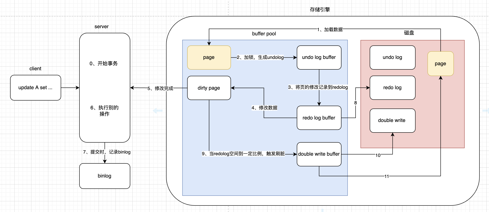
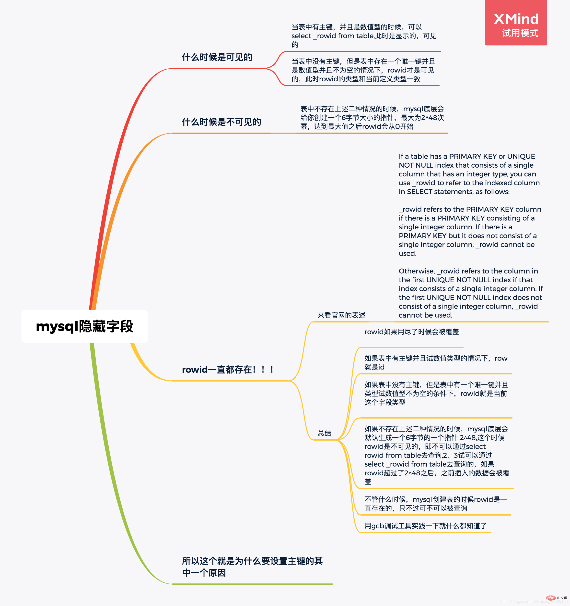

> [基础](https://www.processon.com/view/60596321637689700771c679?fromnew=1#map)
>
> [MySQL 三万字精华总结](https://juejin.cn/post/6850037271233331208#heading-70)
>
> [两阶段提交](https://www.processon.com/view/5e7c1a75e4b06b852ff97db4?fromnew=1#map) [执行过程](https://www.processon.com/view/link/6045cdc46376897969e3e86c)
>
> [Innodb进阶](https://www.processon.com/view/5eba560d1e08530a9bf30e7e?fromnew=1#map)
>
> [mysql实战](https://www.processon.com/view/6048549af346fb1bdfb25365?fromnew=1#map)

## 安装

## 库

### 存储引擎

### 编码设置

## 表

### 删除

[mysql删除重复数据保留id最小（最大）的数据](https://blog.csdn.net/u013967628/article/details/88076520)

### 三范式

### 建表规约

### 主从复制

### 分库分表

### 查询监控

### 查询优化

## 索引

### 索引分类

[B+树原理揭秘与索引优缺点分析](https://segmentfault.com/a/1190000044668913)

[MySQL索引-B+树（看完你就明白了）](https://www.cnblogs.com/cangqinglang/p/15042752.html)

[MySQL索引原理及BTree（B-/+Tree）结构详解](https://blog.csdn.net/u013967628/article/details/84305511)

- [覆盖索引](https://www.cnblogs.com/wang-meng/p/ae6d1c4a7b553e9a5c8f46b67fb3e3aa.html)
- [最左匹配](https://cloud.tencent.com/developer/article/1774781)

- [索引下推](https://juejin.cn/post/7005794550862053412)：

​		索引查询级别为range时，才会触发索引下推

### 索引规约


### 索引优化

### 

## 事务

[两阶段提交](https://www.processon.com/view/5e7c1a75e4b06b852ff97db4?fromnew=1#map) 

[执行过程](https://www.processon.com/view/link/6045cdc46376897969e3e86c)

[Double Write](https://blog.csdn.net/jc_benben/article/details/78967380)

### 锁

​		行锁和表锁各有其适用场景。行锁适用于高并发环境下的数据访问和事务处理，可以最大限度地减少锁定的资源范围，提高系统的并发性能。而表锁则适用于非事务型表的写操作、需要明确控制并发访问的场景以及批量数据导入和导出等特定情况。在实际应用中，应根据具体的业务需求和性能要求来选择合适的锁机制。

1. [对mysql乐观锁、悲观锁、共享锁、排它锁、行锁、表锁概念的理解](https://blog.csdn.net/u013967628/article/details/80651044)

## 日志

[详细分析MySQL事务日志(redo log和undo log)](https://www.cnblogs.com/f-ck-need-u/archive/2018/05/08/9010872.html)

[Mysql 重做日志](https://blog.csdn.net/jc_benben/article/details/65431530)

[MySQL中的redolog的作用](https://blog.csdn.net/weixin_29174385/article/details/113225411)

[mysql redo日志与刷脏](https://www.cnblogs.com/xxmysql/p/5754211.html)



## 缓冲池

[缓冲池(buffer pool)](https://blog.csdn.net/shenjian58/article/details/93268633)

[MySQL InnoDB Buffer Pool](https://www.ywnds.com/?p=9886)

## MVCC

[MySQL中MVCC的正确打开方式](https://blog.csdn.net/Waves___/article/details/105295060#1.2、Read%20View%20结构)

[正确的理解MySQL的MVCC及实现原理](https://blog.csdn.net/SnailMann/article/details/94724197)

[MySQL的ReadView](https://blog.csdn.net/thesprit/article/details/112970122)

## 窗口函数

## with

[WITH recursive使用](https://blog.csdn.net/sin_dapeng/article/details/121673632)

```sql
-- 递归查询所有二级部门下的子部门
WITH recursive temp AS(
    SELECT dept_logic_id,dept_name,dept_logic_id as parentId FROM bams_dept WHERE parent_logic_id='0001'
    UNION ALL
    SELECT u.dept_logic_id,u.dept_name,t.parentId FROM bams_dept u,temp t WHERE u.parent_logic_id=t.dept_logic_id
),temp2 as (select parentId,group_concat(dept_logic_id) from temp GROUP BY parentId)
select * from temp2;


```

## 数据批量删除后优化

- innodb 

```sql
-- 查询表空间
show table status like 'scene_qrcode_scan_log';
-- 优化
ANALYZE TABLE scene_qrcode_scan_log;
```

- myisam

```sql
OPTIMIZE TABLE scene_qrcode_scan_log_20220602;
```

## rowid

[掌握mysql隐藏字段(rowid)什么时候是可见的](https://www.php.cn/mysql-tutorials-468451.html)




