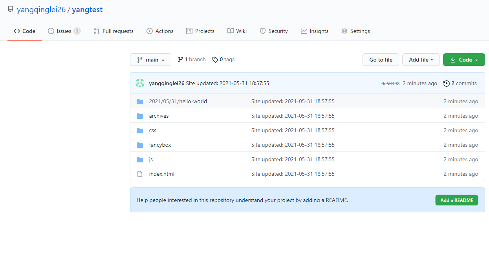
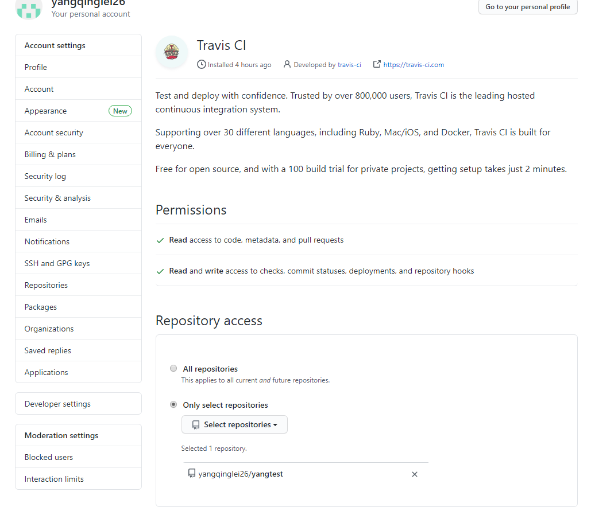

[官方文档](https://hexo.io/docs/)

## 1. 依赖环境（windows）

- 安装git
- 安装node

## 2. 安装

### 2.1. 安装客户端并初始化工作目录

```bash
# 全局安装hexo客户端
npm install -g hexo-cli
# 初始化目录结构
cd <folder>
hexo init
```


### 2.2. 安装服务并启动

```bash
# 进入工作目录，安装 hexo-server 服务依赖
npm install hexo-server --save
# 启动hexo，默认端口 4000 
# hexo server -p <端口号>
hexo server
```


- 输入 http://localhost:3000 ，测试是否部署成功：


## 3. 发布到Github

### 3.1. 配置SSH

> 参考资料：[Git](../Git/#7-1-SSH%E9%85%8D%E7%BD%AE)

### 3.2. 将文件发布到github

#### 3.2.1. 安装部署依赖

```bash
# 进入工作目录
npm install hexo-deployer-git --save
```

#### 3.2.2. 修改配置

- 修改工作目录下的 _config.yml：

```yaml
deploy:
  type: git
  repo: <repository url> #https://bitbucket.org/JohnSmith/johnsmith.bitbucket.io
  branch: [branch]
  message: [message]
```


#### 3.2.3. 测试是否成功

```bash
# 清空缓存和publc目录
hexo clean
# 生成静态yem
hexo generate
# 部署到git
hexo deploy
```


- 登陆github，查看是否提交成功



### 3.3. 设置GitHub Pages


- 修改根url


- 重新部署

```
hexo clean
hexo generate
hexo deploy
```


## 4. 切换主题

> [主题](https://hexo.io/themes/)
>
> [ayer主题使用](https://shen-yu.gitee.io/2019/ayer/)   （说明： 由于我们会对主题进行二次开发，所以建议使用文中第2种方法进行安装）

### 4.1. 安装主题

```bash
cd <folder>
git clone https://github.com/Shen-Yu/hexo-theme-ayer.git themes/ayer
```

- 修改工作目录下 _config.yml


- 修改语言为中文


### 4.2. 安装插件

```bash
# 搜索插件
npm install hexo-generator-searchdb --save
```


- 修改工作目录下 _config.yml

```yaml
# hexo-generator-searchdb
search:
  path: search.xml
  field: post
  format: html
```


### 4.3. 生成分类和标签页

```bash
# 生成分类页
hexo new page categories
# 生成标签页
hexo new page tags
```


- 然后将以下内容追加到 /source/categories/index.md 文件

```markdown
type: "categories"
layout: "categories"
```


- 然后将以下内容追加到 /source/tags/index.md 文件

```markdown
type: "tags"
layout: "tags"
```


### 4.4. 配置gittalk

> [参考](../Git/#8-GitTalk%E4%BD%BF%E7%94%A8)

- 此url与Git page提供的url保持一致


### 4.4. 修改主题配置文件


```yaml
# 侧边栏菜单
menu:
  主页: /
  归档: /archives
  分类: /categories
  标签: /tags
  关于我: /2019/about

# 站点次标题和打字动效
# https://github.com/mattboldt/typed.js
subtitle:
  enable: true # 是否开启动效
  text: 赢在格局，输在计较 # 显示的文字
  text2:  # 滚动播放，如果不需要可以留空
  text3:  # 最多支持三段文字
  startDelay: 0 # 延迟时间
  typeSpeed: 200 # 打字速度
  loop: false # 是否循环
  backSpeed: 100 # 回退速度
  showCursor: true # 是否显示光标

# 网站图标和侧边栏logo
favicon: /favicon.ico
logo: /images/face.jpg

# 封面配置
# enable-是否启用封面；path-封面背景图；logo-封面logo
cover:
  enable: false
  path: /images/cover1.jpg # /source/images目录下附送多张美图，可更换
  logo: true #/images/ayer.svg，如果不要直接设置成false

# 页面顶部进度条
progressBar: true

# 告示板模块
broadcast:
  enable: true # true开启，false关闭
  type: 2 # 1：自定义输入，2：一言api(https://hitokoto.cn/)
  text: 一个安静优雅的hexo主题，快速且响应式。 # type为1时有效

# 文章配置
# 文章太长，截断按钮文字(在需要截断的行增加此标记：<!--more-->)
excerpt_link: 阅读更多...
# 如果你嫌每篇文章手动加more标记比较麻烦，又不想在首页全文显示，可以把excerpt_all设置成true，这样首页只会显示文章归档
excerpt_all: false

# 是否开启代码复制按钮
copy_btn: true
# 是否开启文章分享按钮
share_enable: false
# 国内的社交平台(If you are not in China, maybe you prefer to set:false)
share_china: true
# 文章分享文字
share_text: 分享

# 分页文字
nav_text:
  page_prev: 上一页
  page_next: 下一页
  post_prev: 上一篇
  post_next: 下一篇

# 文章页是否显示目录
toc: true

# 文章中的图片是否支持点击放大
image_viewer: true

# https://github.com/willin/hexo-wordcount
# 是否开启字数统计(关闭请设置enable为false)
# 也可以单独在md文件里Front-matter设置`no_word_count: true`属性，来自定义关闭字数统计
word_count:
  enable: true
  # 只在文章详情显示(不在首页显示)
  only_article_visit: true

# 打赏
# 打赏type设定：0-关闭打赏； 1-文章对应的md文件里有reward:true属性，才有打赏； 2-所有文章均有打赏
reward_type: 0
# 打赏wording
reward_wording: "请我喝杯咖啡吧~"
# 支付宝二维码图片地址，跟你设置logo的方式一样。比如：/images/alipay.jpg
alipay: https://cdn.jsdelivr.net/gh/Shen-Yu/cdn/img/alipay.jpg
# 微信二维码图片地址
weixin: https://cdn.jsdelivr.net/gh/Shen-Yu/cdn/img/wechat.jpg

# 版权声明
# 版权声明type设定：0-关闭版权声明； 1-文章对应的md文件里有copyright: true属性，才有版权声明； 2-所有文章均有版权声明
copyright_type: 2

# 是否启用搜索
# 需要安装hexo-generator-searchdb(https://github.com/theme-next/hexo-generator-searchdb)
search: true

# RSS订阅(先安装hexo-generator-feed插件，再去博客根目录config进行配置)
# 不想显示可以直接留空
rss: 

# 是否启用黑夜模式开关
darkmode: true

# 动态背景效果: 0-关闭，1-动态线条(跟随鼠标)
canvas_bg: 0

# 自定义鼠标样式，直接替换/images/mouse.cur文件
mouse:
  enable: false
  path: /images/mouse.cur

# 鼠标点击效果：0-关闭，1-爱心，2-爆炸烟花，3-粒子烟花
click_effect: 0

# 页面宽度自定义（不建议修改，可能造成布局混乱），article_width文章宽度，sidebar_width侧边栏宽度
layout:
  article_width: 80rem
  sidebar_width: 8rem

# GitHub Ribbons-封面右上角的forkme，换样式直接在source/images目录下替换forkme图片
github:
  # (关闭请设置为false)
  enable: false
  url: https://github.com/Shen-Yu/hexo-theme-ayer

# 网易云音乐插件
music:
  enable: false
  # 播放器尺寸类型(1：小尺寸、2：大尺寸)
  type: 1
  id: 22707008 # 网易云分享的音乐ID(更换音乐请更改此配置项)
  autoPlay: true # 是否开启自动播放

# 访问量统计(不蒜子)
busuanzi:
  enable: true

# 友盟cnzz统计(url填js代码src链接)
cnzz:
  enable: false
  url: https://s9.cnzz.com/z_stat.php?id=1278069914&web_id=1278069914

# Google Analytics
google_analytics: ""
# 百度统计
baidu_analytics: "awwssw1snsnsnn1ndndnndnd99j"

# Mathjax数学公式
mathjax: false

# Katex数学公式(allpost设置为false时只有头部设置math:true的文章才开启)
# 需要更换hexo渲染器，npm un hexo-renderer-marked -S && npm i hexo-renderer-markdown-it-katex -S
katex:
  enable: false # true
  allpost: true
  copy_tex: false

# mermaid流程图 三个选项缺一不可(https://mermaid-js.github.io/mermaid/)
mermaid:
  enable: false
  cdn: https://cdn.jsdelivr.net/npm/mermaid@8.9.2/dist/mermaid.min.js
  theme: forest

# 网站成立年份(默认为 2019，若填入年份小于当前年份，则显示为 2018-2019 类似的格式)
since: 2020

# 是否显示页脚信息(建议保留)
pageFooter: false

# ICP备案信息尾部显示
icp:
  enable: false
  url: "http://www.beian.miit.gov.cn/" # 备案链接
  text: "浙ICP备88888888" # 备案信息
# 公安备案信息尾部显示
gongan:
  enable: false
  img: /images/beian.png #公安备案图片
  url: "http://www.beian.gov.cn/portal/registerSystemInfo?recordcode=01234567890123" #公安备案链接
  text: "浙公网安备01234567890123号" #公安备案信息

# 友情链接
friends_link:
  Ayer主题: #网站名称
    #网站地址
    url: https://github.com/Shen-Yu/hexo-theme-ayer
    #网站图片(可忽略不写)
    img: /images/ayer.png
  GitHub:
    url: https://github.com/Shen-Yu
    img: https://cdn.jsdelivr.net/gh/Shen-Yu/cdn/img/github.png
  码云:
    url: https://gitee.com/shen-yu
    img: https://cdn.jsdelivr.net/gh/Shen-Yu/cdn/img/gitee.png
  Hexo官网:
    url: https://hexo.io
    img: https://cdn.jsdelivr.net/gh/Shen-Yu/cdn/img/hexo.png
  Hexo图表插件:
    url: https://github.com/Shen-Yu/hexo-tag-chart
    img: https://cdn.jsdelivr.net/gh/Shen-Yu/cdn/img/hexo-tag-chart.png

# 评论：1、Valine(推荐)；2、Gitalk；3、Twikoo; 4.MiniValine

# 1、Valine[一款快速、简洁且高效的无后端评论系统](https://github.com/xCss/Valine)
# 启用Valine必须先创建leancloud应用， 获取 id|key 填入即可
leancloud:
  enable: false
  app_id: #
  app_key: #
# Valine配置
valine:
  enable: true # 是否启用
  avatar: monsterid # 头像样式(https://valine.js.org/avatar.html)
  placeholder: 给我的文章加点评论吧~ # placeholder

# 2、Gitalk(https://github.com/gitalk/gitalk)
gitalk:
  enable: true # true
  clientID: 129f2c758bba8433d4c8 # GitHub Application Client ID
  clientSecret: eeb34f70e9dfcf7e04e8d9a9206136315394f8c1 # Client Secret
  repo: yangtest # Repository name
  owner: yangqinglei26 # GitHub ID
  admin: yangqinglei26 # GitHub ID


# 3、Twikoo(https://github.com/imaegoo/twikoo)
twikoo:
  enable: false
  envId: #

# 4、MiniValine
# See: https://github.com/MiniValine/MiniValine
minivaline:
  enable: false
  # 更多选项 https://minivaline.js.org/docs/cn/#/Options 按照yml格式继续填写即可 （除了 [el] 选项）
  # emoticonUrl 等列表选项 可参考 https://github.com/MiniValine/hexo-next-minivaline
  # 下面是一个例子：
  serverURL: https://minivaline.your-domain.com

# 首页广告配置
# 可以根据需要自行增加ad_3，ad_4...，留空则不显示，建议图片和url不要带ad等关键词，否则可能会被adblock等插件屏蔽
# ads:
#   ad_1:
#     title: 腾讯云限时秒杀
#     img: https://cdn.jsdelivr.net/gh/Shen-Yu/cdn/img/ten_1.jpg
#     url: https://curl.qcloud.com/ezctH6FU
#     width: 300
#   ad_2:
#     title: 云服务器全球购低至2折
#     img: https://cdn.jsdelivr.net/gh/Shen-Yu/cdn/img/ten_2.jpg
#     url: https://curl.qcloud.com/kvO7hb43
#     width: 300

```

### 4.5. 部署并测试

```bash
# 清空缓存 
hexo clean
# 生成public文件并部署到github
hexo g -d
```

- 访问 https://yangqinglei26.github.io/yangtest

## 5. 解决图片展示问题

### 5.1. 安装图片处理插件

```bash
cd <工作目录>
npm install hexo-asset-image --save
```

### 5.2. 修改插件文件 `/node_modules/hexo-asset-image/index.js`

```javascript
'use strict';
var cheerio = require('cheerio');

// http://stackoverflow.com/questions/14480345/how-to-get-the-nth-occurrence-in-a-string
function getPosition(str, m, i) {
  return str.split(m, i).join(m).length;
}

var version = String(hexo.version).split('.');
hexo.extend.filter.register('after_post_render', function(data){
  var config = hexo.config;
  if(config.post_asset_folder){
    	var link = data.permalink;
	if(version.length > 0 && Number(version[0]) == 3)
	   var beginPos = getPosition(link, '/', 1) + 1;
	else
	   var beginPos = getPosition(link, '/', 3) + 1;
	// In hexo 3.1.1, the permalink of "about" page is like ".../about/index.html".
	var endPos = link.lastIndexOf('/') + 1;
    link = link.substring(beginPos, endPos);

    var toprocess = ['excerpt', 'more', 'content'];
    for(var i = 0; i < toprocess.length; i++){
      var key = toprocess[i];
 
      var $ = cheerio.load(data[key], {
        ignoreWhitespace: false,
        xmlMode: false,
        lowerCaseTags: false,
        decodeEntities: false
      });

      $('img').each(function(){
		if ($(this).attr('src')){
			// For windows style path, we replace '\' to '/'.
			var src = $(this).attr('src').replace('\\', '/');
			if(!/http[s]*.*|\/\/.*/.test(src) &&
			   !/^\s*\//.test(src)) {
			  // For "about" page, the first part of "src" can't be removed.
			  // In addition, to support multi-level local directory.
			  var linkArray = link.split('/').filter(function(elem){
				return elem != '';
			  });
			  var srcArray = src.split('/').filter(function(elem){
				return elem != '' && elem != '.';
			  });
			  if(srcArray.length > 1)
				srcArray.shift();
			  src = srcArray.join('/');
			  $(this).attr('src', "/" + link + src);
			  console.info&&console.info("update link as:-->"+"/" + link + src);
			}
		}else{
			console.info&&console.info("no src attr, skipped...");
			console.info&&console.info($(this));
		}
      });
      data[key] = $.html();
    }
  }
});
```

### 5.3. 修改工作目录下 _config.yml 

```bash
post_asset_folder: true
```

> 参考资料：[Ericam](https://blog.csdn.net/xjm850552586/article/details/84101345)

## 6. 集成Travis CI

### 6.1. 配置 personal access token

#### 6.1.1. 生成 access token


#### 6.1.2. 拷贝access token到记事本，保存以备用


### 6.2. 配置 Travis CI

#### 6.2.1. 将 [Travis CI](https://github.com/marketplace/travis-ci) 添加到你的 GitHub 账户中


#### 6.2.2. 前往 GitHub 的 [Applications settings](https://github.com/settings/installations)，配置 Travis CI 权限，使其能够访问你的 repository




#### 6.2.3. 将Github生成的 personal access token添加到travis中


### 6.3. 配置 .travis.yml

#### 6.3.1. 工作目录下新建 .travis.yml

```yaml
# 指定构建环境是Node.js，当前版本是稳定版
anguage: node_js
node_js: stable

# 设置钩子只检测blog-source分支的push变动
branches:
  only:
    - main

# 设置缓存文件
cache:
  directories:
    - node_modules

#在构建之前安装hexo环境和主题，这里的主题就是原来修改过的主题，我将其托管到另一个github仓库，直接clone就行，否则每次都是新的主题，要重新设置。
before_install:
  - npm install -g hexo-cli

#安装git插件和搜索功能插件
install:
  - npm install
  - npm install hexo-deployer-git --save
  - npm install hexo-generator-searchdb --save
  - npm install hexo-asset-image --save


# 执行清缓存，生成网页操作
# 将 5.2 中的index.js 拷贝到imagedeal中
script:
  - rm -rf ./node_modules/hexo-asset-image/index.js
  - cp ./imagedeal/index.js ./node_modules/hexo-asset-image
  - hexo clean
  - hexo generate

# 设置git提交名，邮箱；替换真实token到_config.yml文件，最后depoy部署
after_script:
  - git config user.name "yangqinglei26"
  - git config user.email "dandetionyang@163.com"
  # 替换同目录下的_config.yml文件中gh_token字符串为刚才在6.2.3中travis配置的变量，注意此处sed命令用了双引号。单引号无效！
  - sed -i "s/gh_token/${GH_TOKEN}/g" ./_config.yml
  - hexo deploy
```


#### 6.3.2. 修改 _config.yml


### 6.4. 提交到github，并测试

#### 6.4.1. 删除 themes\ayer 下多余的文件


#### 6.4.2.  提交并测试

```bash
# 清空分支下所有文件
git init 
git add .
git commit -m "初始化仓库"
git remote add origin https://github.com/yangqinglei26/yangtest.git
git push -u origin master:main
```


