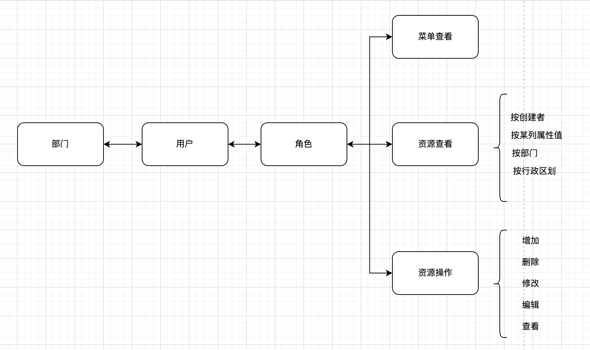

## 数据权限的选择

### 数据规则

​	    我们在设计数据权限时要根据实际的数据使用场景来进行设计，常见的使用场景有按创建者过滤、按所属部门（本部门、本部门及子部门、自定义部门）过滤、按行政区划过滤、按某列属性值过滤等，这些过滤条件决定了我们在采集数据时赋予数据特定的标签属性。那具体到rbac整个架构中，我们如何给各个用户划分数据资源呢？首先，我们先梳理一下rbac架构，它包含部门、用户、角色、资源操作的管理，各主体之间是n对n的关系，我们通过角色来管理用户可以对资源进行哪些操作，而资源操作的前提是用户能看见哪些资源，这里我们尝试通过角色来划分数据资源权限，看看后续使用中会有哪些问题，哪些场景不适用。

### 数据量

## 参考

[RBAC模型整合数据权限](https://blog.csdn.net/jianzhang11/article/details/114314505)

